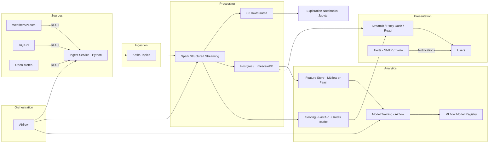

# Smart Environmental Monitoring System

This project is a comprehensive, real-time environmental monitoring system that ingests data from various sources, processes it in a scalable pipeline, and provides analytics and visualizations.

## Architecture



## Phase 1: Core ETL & Analytics MVP (Batch-based)

This first phase focuses on getting data from the APIs to a curated dataset, ready for analysis.

### How to Run Phase 1

1.  **Set up Environment Variables:**

    Create a `.env` file in the root of the project and add your API keys:

    ```
    WEATHERAPI_API_KEY=your_weatherapi_key
    AQICN_API_KEY=your_aqicn_key
    ```

2.  **Install Dependencies:**

    ```bash
    pip install -r requirements.txt
    ```

3.  **Run the ETL Pipeline:**

    The following commands will run the entire ETL pipeline:

    *   **Ingestion:** Fetches data from the APIs and saves it to `data/raw`.
    *   **Transformation:** Processes the raw data and saves it to `data/curated/environmental_data.parquet`.
    *   **Analysis:** Reads the curated data and prints a summary.

    ```bash
    python app.py
    python batch_transform.py
    python analyze.py
    ```

## File Layout

```
env-monitoring/
├─ .env
├─ data/
│  ├─ raw/
│  └─ curated/
├─ app.py
├─ batch_transform.py
├─ phase_1_etl_dag.py
├─ validation.py
├─ analyze.py
├─ requirements.txt
├─ .gitignore
└─ README.md
```
