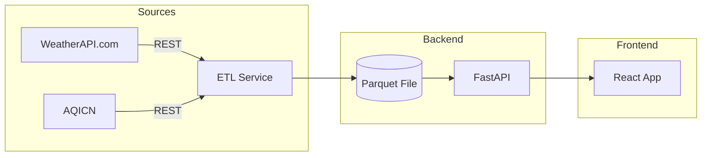

# Smart Environmental Monitoring System

This project is a comprehensive, real-time environmental monitoring system that ingests data from various sources, processes it in a scalable pipeline, and provides a modern, interactive web interface for data visualization and analysis.

## Features

*   **Automated ETL Pipeline:** Data is automatically fetched, cleaned, and processed in the background.
*   **Interactive Dashboard:** A user-friendly dashboard to visualize and interact with the data.
*   **Dynamic Charts:** Charts that switch between bar and line graphs for better data visualization.
*   **City Filtering:** Filter the data by city to focus on a specific location.
*   **Table Sorting:** Sort the data by any numeric column.
*   **Live Clock & Sync Timer:** Keep track of the current time and the next data sync.

## Architecture



## How to Run the Application

1.  **Set up Environment Variables:**

    Create a `.env` file in the root of the project and add your API keys:

    ```
    WEATHERAPI_API_KEY=your_weatherapi_key
    AQICN_API_KEY=your_aqicn_key
    ```

2.  **Install Dependencies:**

    *   **Backend:** `pip install -r serving/requirements.txt`
    *   **Frontend:** `cd frontend/client && npm install`

3.  **Run the Application:**

    *   **Start the Backend:**
        ```bash
        # In the 'serving' directory
        python -m uvicorn main:app --host 0.0.0.0 --port 8000
        ```

    *   **Start the Frontend:**
        ```bash
        # In the 'frontend/client' directory
        npm run dev
        ```

4.  **Explore:**

    Open your browser to `http://localhost:5173`.

## File Layout

```
env-monitoring/
├─ .env
├─ data/
│  ├─ raw/
│  └─ curated/
├─ frontend/
│  └─ client/
│     ├─ public/
│     ├─ src/
│     │  ├─ components/
│     │  ├─ context/
│     │  ├─ pages/
│     │  ├─ App.jsx
│     │  ├─ index.css
│     │  └─ main.jsx
│     ├─ package.json
│     └─ vite.config.js
├─ serving/
│  ├─ main.py
│  └─ requirements.txt
├─ validation.py
├─ CHECKPOINT.md
├─ .gitignore
└─ README.md
```
