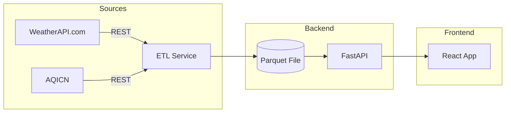

# Smart Environmental Monitoring System 🌍

A comprehensive, real-time environmental monitoring platform that tracks air quality, weather conditions, and environmental health across India. Built with modern web technologies and featuring an intuitive, feature-rich interface for data visualization and analysis.

## 🌟 Key Features

### Core Functionality
- **🔄 Automated ETL Pipeline:** Real-time data ingestion from multiple sources every 5 minutes
- **📊 Interactive Dashboard:** Comprehensive data visualization with dynamic charts
- **🗺️ Geographic Visualization:** Interactive maps with color-coded environmental metrics
- **🚨 Smart Alert System:** Customizable thresholds with real-time notifications
- **⚙️ Configurable Settings:** Personalize your monitoring experience
- **📱 Responsive Design:** Seamless experience across all devices

### New in Version 3.0
- **Seven Interactive Pages:** Home, Dashboard, Statistics, Maps, Alerts, Settings, and About
- **Enhanced Navigation:** Icon-based menu with mobile-friendly responsive design
- **Animated UI:** Smooth transitions and micro-interactions using Framer Motion
- **Live Environmental Alerts:** Real-time warning system for hazardous conditions
- **Professional Home Page:** Feature showcase with live statistics
- **Docker Production Ready:** Optimized containers with health checks

## Architecture



## 🚀 Quick Start

### Prerequisites
- Python 3.11+
- Node.js 20+
- Docker & Docker Compose (optional)

### Installation

1. **Clone the repository:**
   ```bash
   git clone https://github.com/yourusername/Smart-Environmental-Monitoring.git
   cd Smart-Environmental-Monitoring
   ```

2. **Set up environment variables:**
   Create a `.env` file in the root directory:
   ```env
   WEATHERAPI_API_KEY=your_weatherapi_key
   AQICN_API_KEY=your_aqicn_key
   ```

   Get your free API keys from:
   - WeatherAPI: https://www.weatherapi.com/
   - AQICN: https://aqicn.org/api/

3. **Install dependencies:**

   **Backend:**
   ```bash
   cd serving
   pip install -r requirements.txt
   ```

   **Frontend:**
   ```bash
   cd frontend/client
   npm install
   ```

### Running the Application

#### Option 1: Local Development

**Backend:**
```bash
cd serving
python -m uvicorn main:app --host 0.0.0.0 --port 8000 --reload
```

**Frontend:**
```bash
cd frontend/client
npm run dev
```

Access the application at `http://localhost:5173`

#### Option 2: Docker (Recommended for Production)

```bash
docker-compose up --build
```

Access the application at `http://localhost:3000`

## 📁 Project Structure

```
Smart-Environmental-Monitoring/
├── serving/                    # Backend API service
│   ├── main.py                # FastAPI application with ETL
│   ├── validation.py          # Data validation models
│   ├── requirements.txt       # Python dependencies
│   └── Dockerfile             # Backend container config
├── frontend/
│   └── client/                # React application
│       ├── src/
│       │   ├── components/    # Reusable UI components
│       │   ├── pages/         # Application pages (7 total)
│       │   ├── App.jsx        # Main app component
│       │   └── index.css      # Global styles
│       ├── package.json       # Node dependencies
│       ├── nginx.conf         # Production web server
│       └── Dockerfile         # Frontend container config
├── data/                      # Data storage
│   ├── raw/                  # Raw API data
│   └── curated/              # Processed Parquet files
├── docker-compose.yml         # Container orchestration
├── .env                       # Environment variables
└── README.md                  # This file
```

## 🖥️ Pages Overview

### 🏠 Home Page
- Hero section with live environmental statistics
- Feature showcase with quick navigation
- Real-time alert banner for critical conditions
- Technology stack display

### 📊 Dashboard
- Real-time data visualization
- City-wise filtering
- Interactive charts (Bar/Line)
- Sortable data tables
- Live sync timer

### 📈 Statistics
- Advanced analytics and trends
- Correlation matrices
- Historical comparisons
- Aggregated insights

### 🗺️ Maps
- Interactive geographic visualization
- Color-coded metrics (AQI, Temperature, Humidity, Wind)
- City-wise popups with detailed data
- Customizable metric selection

### 🚨 Alerts
- Real-time environmental warnings
- Customizable alert thresholds
- Alert history and management
- Filter by severity levels

### ⚙️ Settings
- Application preferences
- Notification configuration
- Display customization
- Data source management

### ℹ️ About
- Project information
- Team details
- Technology stack
- Contributing guidelines

## 🛠️ Technologies Used

### Frontend
- **React 19.1** - UI framework
- **Vite 7.1** - Build tool
- **Tailwind CSS 3.4** - Styling
- **Recharts** - Data visualization
- **Leaflet** - Interactive maps
- **Framer Motion** - Animations
- **Lucide React** - Icons
- **React Router DOM** - Routing
- **Axios** - HTTP client

### Backend
- **FastAPI** - Web framework
- **Pandas** - Data processing
- **NumPy & SciPy** - Numerical computing
- **PyArrow** - Parquet files
- **APScheduler** - Task scheduling
- **Pydantic** - Data validation
- **Uvicorn** - ASGI server

### DevOps
- **Docker** - Containerization
- **Docker Compose** - Multi-container orchestration
- **Nginx** - Web server
- **GitHub Actions** - CI/CD (planned)

## 📊 Data Sources

- **WeatherAPI.com** - Weather and forecast data
- **AQICN.org** - Air quality index data
- **Coverage** - 20+ major Indian cities
- **Update Frequency** - Every 5 minutes

## 🔧 API Endpoints

- `GET /api/health` - Health check
- `GET /api/data` - Current environmental data
- `GET /api/stats` - Statistical analysis

## 🐳 Docker Configuration

The application includes production-ready Docker configurations with:
- Multi-stage builds for optimization
- Health checks for reliability
- Security hardening with non-root users
- Network isolation
- Environment variable management

## 🤝 Contributing

Contributions are welcome! Please feel free to submit a Pull Request.

## 📝 License

This project is open source and available under the MIT License.

## 👥 Team

Developed by Shivam Garg

## 🙏 Acknowledgments

- WeatherAPI.com for weather data
- AQICN.org for air quality data
- Open source community for the amazing tools

---

**Version 3.0** | Last Updated: November 2024
